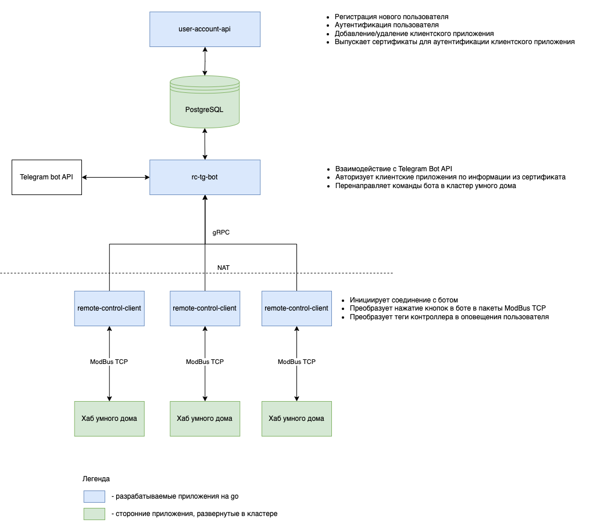

## automation-remote-controller
### Выпускной проект для курса GO-ADV Яндекс Практикума
___

### Техническое задание
Приложение для управления хабом умного дома через Telegram

Сервер:
* регистрация и аутентификация пользователя по логину/паролю
* генерация сертификата для клиентского приложения
* хранение настроек пользователя, доступных пользователю команд и принадлежащих пользователю объектов с клиентскими приложениями
* получение команд через Telegram Bot Api от зарегистрированных на сервере пользователей
* перенаправление команд на клиентское приложение
* отправка пользователю оповещений через Telegram Bot Api, поступивших от клиентского приложения

Клиент:
* инициирует соединение с сервером
* аутентификация на сервере с помощью заранее полученного сертификата
* передача и прием сообщений на сервер используя двунаправленный стриминг gRPC
* конвертация сообщений от сервера в протокол управления объекта автоматизации (ModBus, MQTT)

#### Структурная схема приложения
   
___

#### Схема взаимодействия с системой

1. Пользователь регистрируется на сервере, указывает свое имя в Telegram, получает сертификат для клиентского приложения
2. Устанавливает на хаб умного дома клиентское приложение и добавляет в конфигурации сертификат
   У пользователя может быть несколько объектов автоматизации, для каждого выпускается уникальный сертификат
3. Настраивает связь клиентского приложения и хаба умного дома (реализовано в виде Proof of Concept)
4. Взаимодействует с хабом умного дома через бота Telegram
___

#### Сборка приложения

```shell
make migrate # Запуск миграции базы данных
```

```shell
make build # Сборка бинарных файлов в ./bin
```

```shell
make docker-build # Сборка контейнеров
```

```shell
docker-compose up # Запуск контейнеров
```